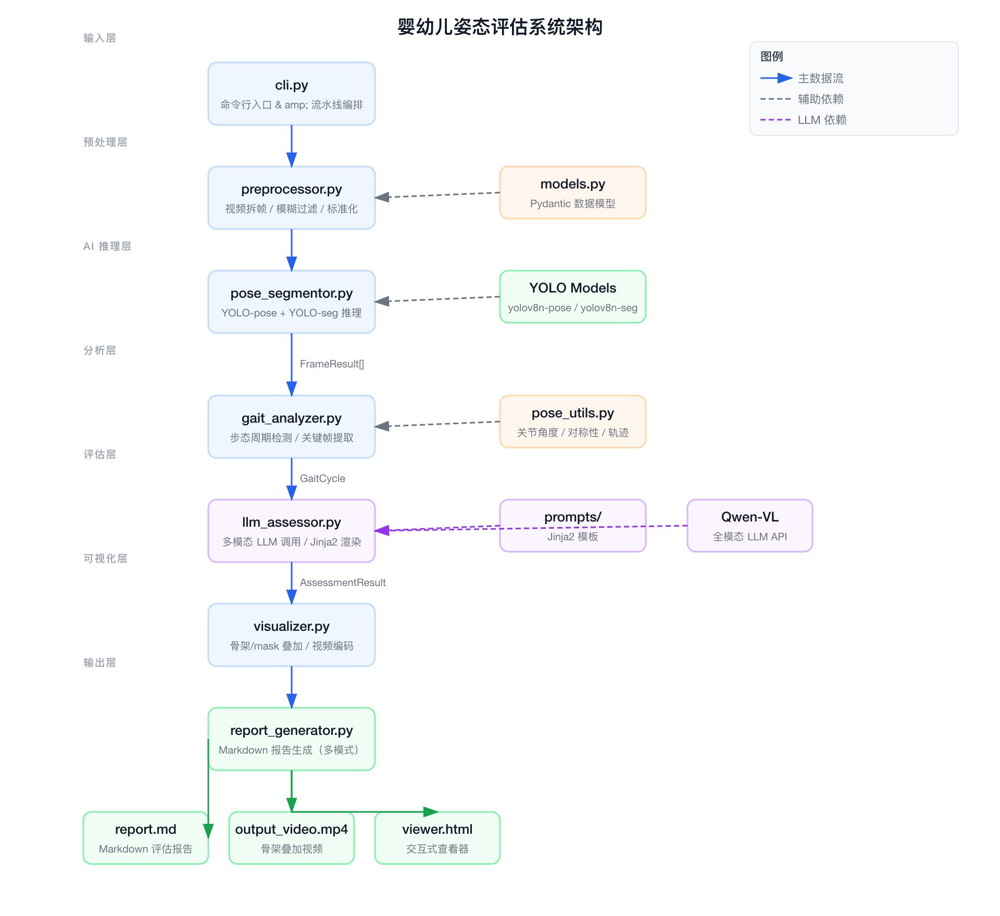

# Infant Posture Assessment System — Architecture

## Overview

The Infant Posture Assessment System is a Python-based CLI tool that analyzes video recordings of infants to evaluate their posture, gait, and developmental milestones. It processes video input through a unidirectional pipeline of specialized modules, leveraging YOLOv8 pose/segmentation models and a multimodal LLM (Qwen-VL) to produce structured assessment reports and annotated visualization videos.

## Architecture Diagram



## Pipeline Components

The system follows a strict left-to-right pipeline where data flows sequentially through the following stages:

### 1. Input Layer — `cli.py`

The command-line entry point and pipeline orchestrator. It parses arguments (video path, assessment mode, child age), validates configuration, and coordinates the execution of downstream modules.

**Supported modes:**

- `gait` — Gait cycle analysis based on ankle trajectory and phase detection
- `developmental` — Motor milestone screening matched to age-appropriate benchmarks
- `posture` — Static standing posture analysis (spine, shoulder, and pelvis symmetry)

### 2. Preprocessing Layer — `preprocessor.py`

Handles video frame extraction, blur detection/filtering, and frame standardization. Ensures only high-quality frames are passed to the AI inference stage.

**Dependency:** `models.py` — Pydantic data models for type-safe data transfer between modules.

### 3. AI Inference Layer — `pose_segmentor.py`

Runs YOLOv8-pose and YOLOv8-seg inference on each frame. Outputs pose keypoints, segmentation masks, and bounding boxes for detected persons.

**Key behaviors:**

- Confidence threshold lowered to 0.3 (infants have smaller body sizes)
- Only the largest detected person is retained per frame
- Outputs a list of `FrameResult` objects

**External dependency:** YOLO model weights (`yolov8n-pose.pt`, `yolov8n-seg.pt`)

### 4. Analysis Layer — `gait_analyzer.py`

Detects gait cycles from ankle Y-coordinate trajectories and extracts key phase frames:

1. Heel strike
2. Mid-stance
3. Toe-off
4. Mid-swing

If cycle detection fails, falls back to uniform sampling of 8 frames.

**Dependency:** `pose_utils.py` — Shared utilities for joint angle computation, symmetry metrics, and temporal trajectory analysis.

### 5. Assessment Layer — `llm_assessor.py`

Constructs multimodal prompts for the LLM using:

- The full video (base64-encoded, preserving temporal continuity)
- Structured pose data (keyframe coordinates, joint angles, temporal metrics)
- Jinja2-rendered prompt templates from `prompts/*.jinja.md`

The template is selected based on `config.assessment_mode`. Returns an `AssessmentResult` with risk level, findings, recommendations, and detailed metrics.

**External dependency:** Qwen-VL API (or compatible multimodal LLM)

### 6. Visualization Layer — `visualizer.py`

Generates annotated output videos with:

- Skeleton overlays (keypoints and limb connections)
- Segmentation masks
- Ankle trajectory traces
- Keyframe markings

Uses `supervision` (`sv.VideoInfo` + `sv.process_video`) for video I/O and `sv.MaskAnnotator` for mask rendering. Falls back to manual `cv2` drawing for per-side/per-point color customization.

### 7. Output Layer — `report_generator.py`

Produces a styled Markdown report with:

- Risk level badge (color-coded: normal / mild / moderate / significant)
- Metric tables (gait / developmental / posture metrics)
- Keyframe images (saved as external files in `key_frames/`, referenced by relative path)
- Findings cards and recommendation cards
- Disclaimer footer

Also generates `viewer.html` for interactive report viewing.

## Data Models

All inter-module communication uses Pydantic models defined in `models.py`:

| Model | Purpose |
|-------|---------|
| `FrameResult` | Per-frame pose keypoints, segmentation mask, bounding box |
| `KeyFrame` | Phase-critical frame with image, keypoints, and metadata |
| `GaitCycle` | Keyframe collection, cycle periods, and gait metrics |
| `PoseMetrics` | Joint angles, symmetry indices, temporal trajectories |
| `AssessmentResult` | LLM output: risk level, findings, recommendations, confidence |
| `AppConfig` | Unified CLI and Pydantic Settings configuration |

## Data Flow Summary

```
Video Input
    ↓
Preprocessor (frame extraction, blur filtering)
    ↓ FrameResult[]
Pose Segmentor (YOLO inference)
    ↓ FrameResult[]
Gait Analyzer (cycle detection, keyframe extraction)
    ↓ GaitCycle
LLM Assessor (multimodal assessment)
    ↓ AssessmentResult
Visualizer (skeleton/mask overlay video)
    ↓
Report Generator (Markdown report + viewer.html)
    ↓
Outputs: report.md, output_video.mp4, viewer.html
```

## Key Design Decisions

1. **Dual-channel LLM input**: The LLM receives both the full video (for contextual understanding) and structured pose data text (for precise coordinate analysis), providing cross-validation.
2. **Externalized prompt templates**: Each assessment mode has its own Jinja2 template in `prompts/`. Adding a new mode only requires a new template file.
3. **Shared pose utilities**: Joint angles, symmetry metrics, and trajectory computations are centralized in `pose_utils.py` for reuse across all three assessment modes.
4. **External keyframe images**: Keyframe images are saved as separate `.jpg` files in `key_frames/` and referenced by relative path in the Markdown report, keeping the report file size manageable.
5. **Supervision-first visualization**: Video processing uses `supervision` abstractions where possible, falling back to `cv2` only for features not supported by the library.
